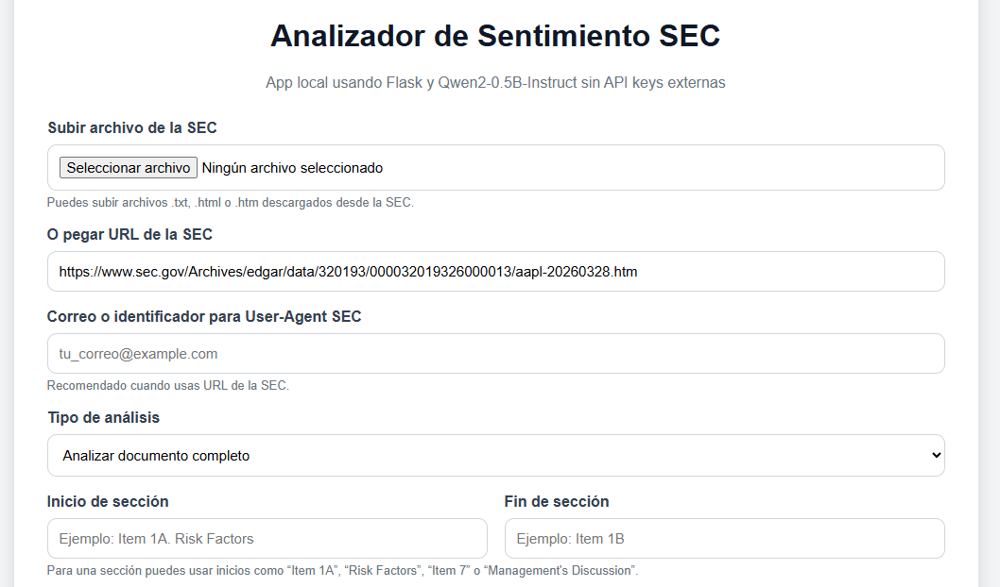

# Analizador de Sentimiento de Archivos SEC con Qwen2-0.5B

Esta aplicación web permite analizar el sentimiento financiero de un archivo de la SEC usando un modelo LLM local.

El proyecto utiliza **Qwen2-0.5B-Instruct**, Flask y Transformers. No utiliza API keys de OpenAI, Gemini, Claude ni de ningún otro modelo externo.

## Funcionalidades

- Subir un archivo `.txt`, `.html` o `.htm` de la SEC.
- Pegar una URL de la SEC.
- Analizar el documento completo.
- Analizar una sola sección del documento usando palabras de inicio y fin.
- Obtener un sentimiento general: Positivo, Negativo o Neutral.
- Mostrar análisis parciales por fragmentos del documento.

## Captura de la app



## Estructura del proyecto

```text
sentimiento-sec-qwen/
│
├── app.py
├── requirements.txt
├── README.md
├── .gitignore
│
├── templates/
│   └── index.html
│
└── screenshots/
    └── app.png
